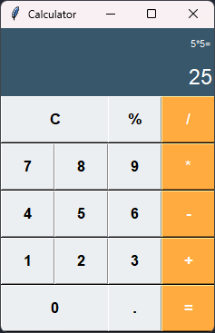

O novo lançamento daquela marca de câmeras dos anos 2000: <b>A CALCULADORA EM PYTHON</b>

Esse projeto teve como base a calculadora do nosso amigo do vídeo abaixo:
<h4><a href="https://youtu.be/i24MxljM-Bw?si=FJanX8wzRXTikxhS">Como fazer Calculadora em Python | Python na pratica #python</a></h4>

Embora a calculadora dele tenha sido a base do projeto, existem algumas diferenças. Essa tenta se aproximar um pouco mais da calculadora do Windows.

Screenshots:

